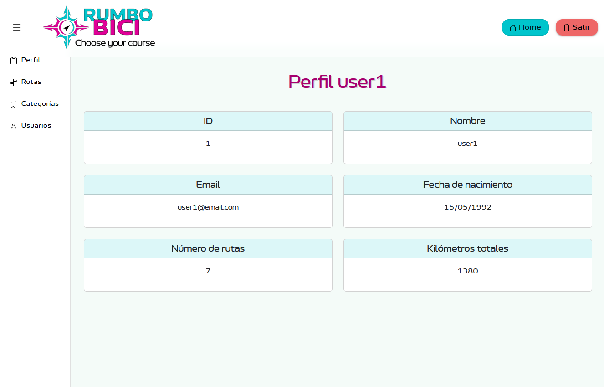
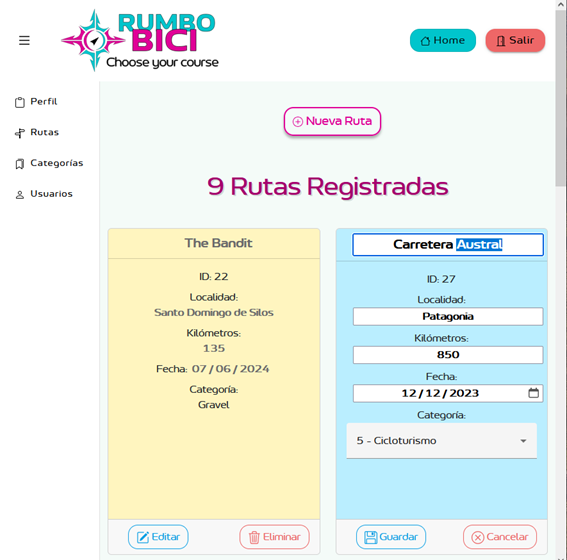
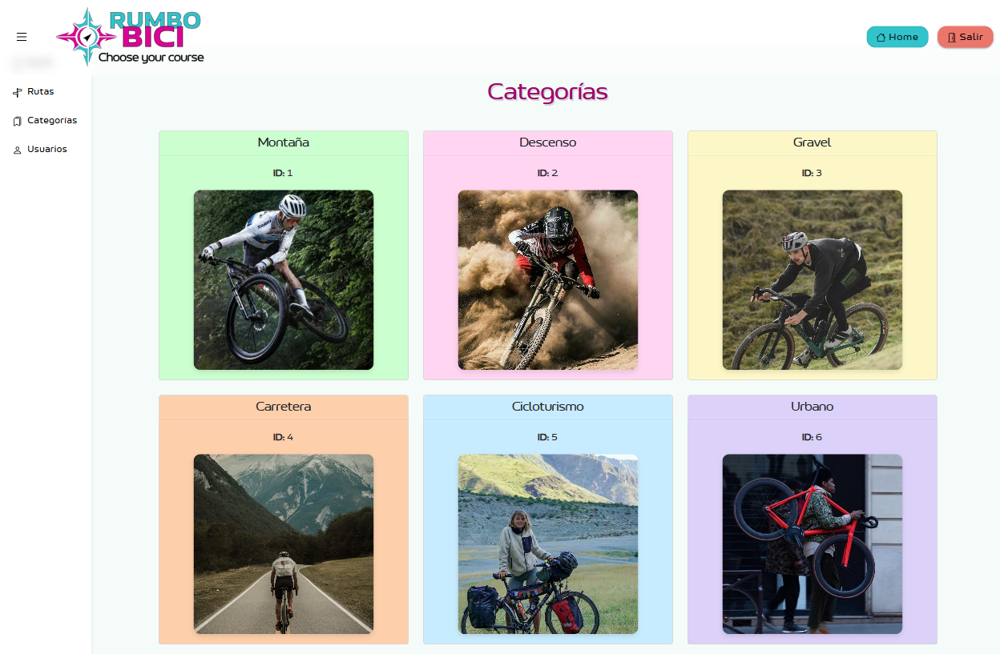
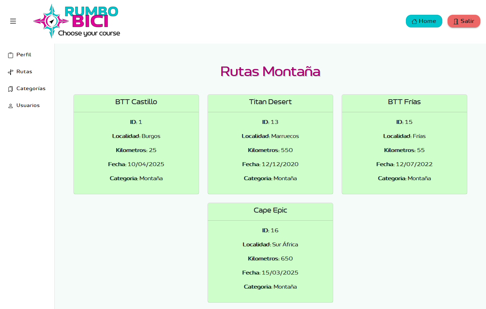
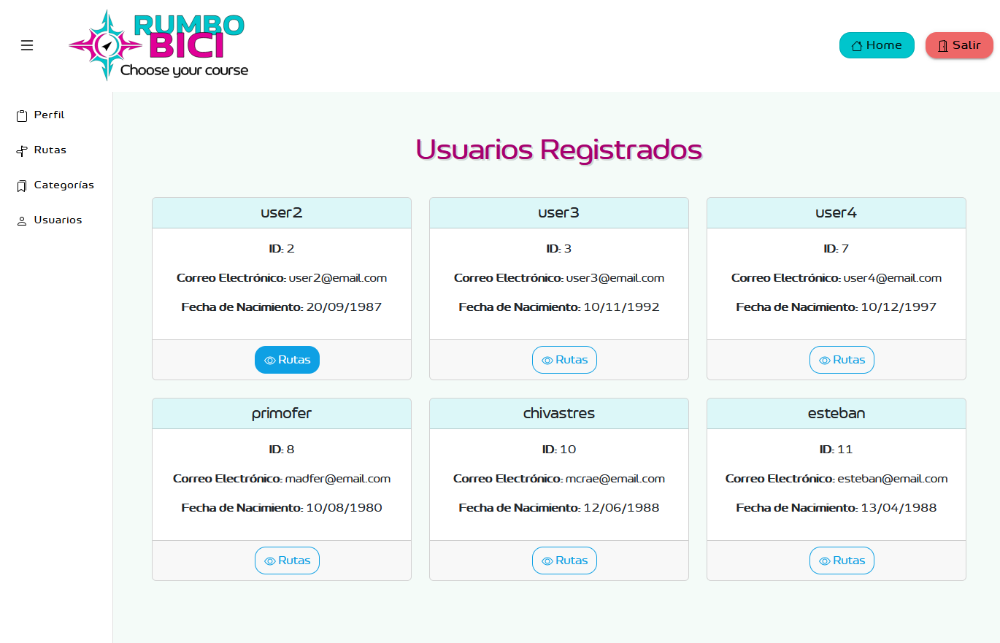
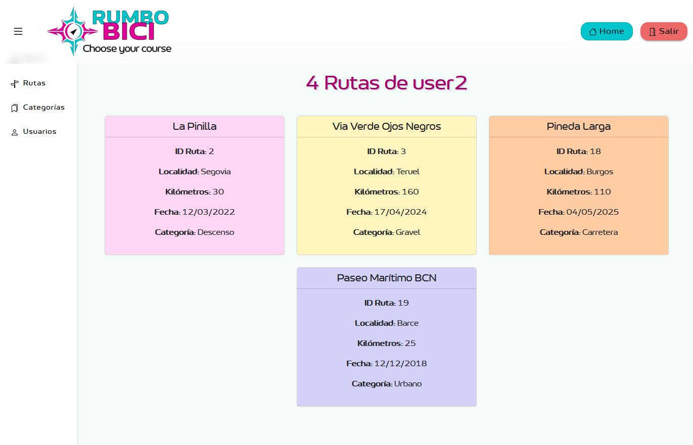

  

  

##  🚴‍♂️  Descripción

Aplicación web cuyo propósito es registrar y gestionar actividades realizadas en bicicleta. Facilita un seguimiento eficiente del historial de rutas, permitiendo almacenar, consultar, editar y eliminar la información relacionada con cada actividad.

Buscando promover estilos de vida saludables, sostenibles y conectar con el entorno, el uso de la bicicleta ha cobrado una relevancia especial, no solo como medio de transporte, sino también como una herramienta de descubrimiento personal y social. 
La aplicación nace con el objetivo de apoyar y potenciar este estilo de vida, ofreciendo a los usuarios una plataforma digital donde puedan registrar y organizar sus rutas. 

  

## 🛠️ Tecnologías de desarrollo

### 🎨 Identidad visual
- Inkscape
- GIMP

### 💻 Frontend
- Bootstrap 5
- Angular v19
  - HTML5
  - SCSS
  - TypeScript

### ⚙ Backend
- Spring Boot v3.4.4
  - Java v21.0.6
  - Spring Web
  - Spring Data JPA
  - MySQL Driver

### 🗄️ Base de datos
- MySQL

### 🚀 Despliegue

#### Backend – Railway
- Railway
- Docker
- Linux
- GitHub 

#### Frontend – Firebase
- Firebase CLI

  

## 🖼️ Vista previa del proyecto

A continuación se muestran algunas capturas clave del funcionamiento de la aplicación para ilustrar su estructura y funcionalidades.

### 👤 Perfil de usuario
- Información principal del usuario.
- Menú lateral desplegable con los distintos apartados: rutas, categorías y todos los usuarios registrados en la aplicación.

> 📷 Ilustración 1.1: Captura del perfil de usuario  

---

### 🗺️ Gestión de rutas
- Listado de todas las rutas.
- Creación de nuevas rutas.
- Edición y eliminación de rutas existentes.

> 📷 Ilustración 2.1: Captura del apartado de rutas  

---

### 🗂️ Visualización por categorías

> 📷 Ilustración 3.1: Captura de las categorías  

> 📷 Ilustración 3.2: Captura de rutas por categoría  

---

### 👥 Usuarios
- Listado de todos los usuarios registrados.
- Posibilidad de visualizar las rutas asociadas a cada uno.

> 📷 Ilustración 4.1: Captura de usuarios registrados  

> 📷 Ilustración 4.2: Captura de rutas del usuario seleccionado  

